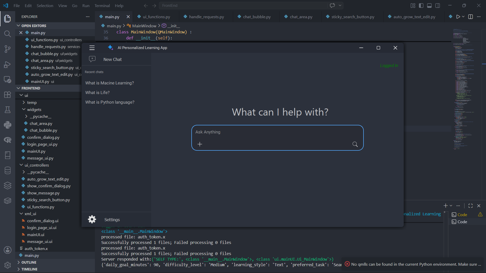
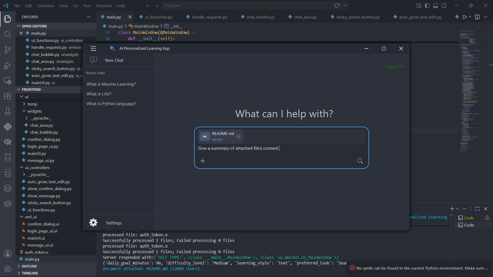
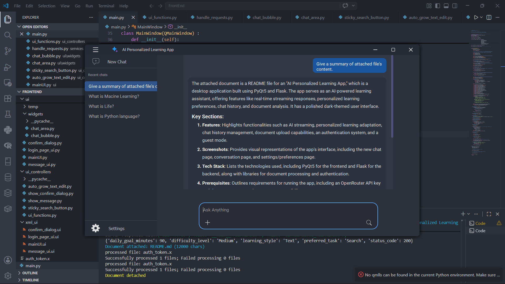
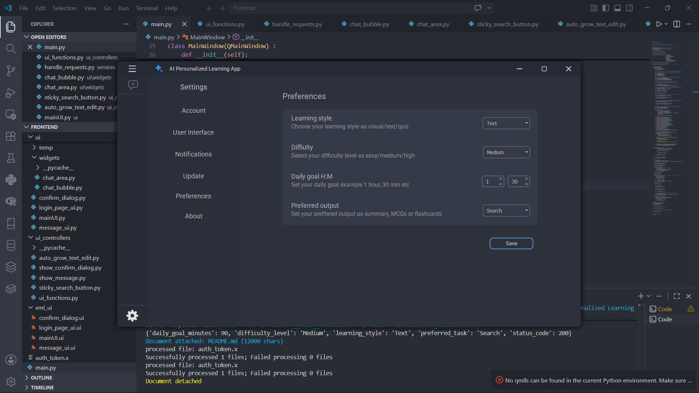

# 🎓 AI Personalized Learning App

<p align="center">
  
</p>

<p align="center">
  A desktop AI-powered learning assistant built with <strong>PyQt5</strong> and <strong>Flask</strong>, featuring real-time streaming responses, personalized learning preferences, chat history, document analysis, and a polished dark-themed UI.
</p>

<p align="center">
  
  
  
  
  
</p>

---

## 📋 Table of Contents

- [Features](#-features)
- [Screenshots](#-screenshots)
- [Tech Stack](#-tech-stack)
- [Prerequisites](#-prerequisites)
- [Installing Python 3.10.0](#-installing-python-3100)
- [Project Setup](#-project-setup)
- [Directory Structure](#-directory-structure)
- [Configuration](#-configuration)
- [Running the App](#-running-the-app)
- [How It Works](#-how-it-works)
- [API Endpoints](#-api-endpoints)
- [Troubleshooting](#-troubleshooting)
- [Contributing](#-contributing)

---

## ✨ Features

| Feature | Description |
|---|---|
| 🤖 **AI Streaming** | Real-time token-by-token streaming responses from GPT-4o-mini via OpenRouter |
| 📚 **Personalized Learning** | Adapts responses by learning style (Text / Visual / Quiz), difficulty, and task type |
| 💬 **Chat History** | Persistent per-user chat sessions stored in SQLite with full conversation replay |
| 📄 **Document Upload** | Attach PDFs, DOCX, TXT, and code files — the AI reads and answers questions about them |
| 🔐 **Auth System** | JWT-based login/signup with secure token storage and automatic session verification |
| 🌙 **Dark UI** | Polished frameless PyQt5 window with custom title bar, sidebar animation, and syntax-highlighted code blocks |
| ⏹️ **Stop Generation** | Interrupt any streaming response mid-flight |
| 🗂️ **Chat Management** | Rename or delete any past conversation via right-click context menu |
| 🧠 **Guest Mode** | Use the app without an account — last 10 turns kept in memory |

---

## 📸 Screenshots

> Screenshots are taken from the running desktop application.

### New Chat Page
 

### Attaching Document with User Prompt
 

### Conversation Page (with streaming)


### Settings / Preferences Page


---

## 🛠️ Tech Stack

### Frontend
| Library | Purpose |
|---|---|
| **PyQt5 5.15.9** | Desktop UI framework |
| **Qt Designer** | UI layout (`.ui` → `.py` via `pyuic5`) |
| **python-markdown** | Convert AI markdown to HTML in chat bubbles |
| **Pygments + CodeHilite** | Syntax-highlighted code blocks |
| **PyMuPDF (fitz)** | PDF text extraction |
| **python-docx** | DOCX text extraction |

### Backend
| Library | Purpose |
|---|---|
| **Flask 3.x** | REST API server |
| **Flask-CORS** | Cross-origin support |
| **Flask-SQLAlchemy** | ORM for SQLite |
| **LangChain** | LLM orchestration and conversation memory |
| **langchain-openai** | OpenAI-compatible LLM client (via OpenRouter) |
| **PyJWT** | JWT auth token encoding / decoding |
| **Werkzeug** | Password hashing |
| **tiktoken** | Token counting for memory trimming |
| **python-dotenv** | Environment variable management |

---

## 📌 Prerequisites

Before you begin, make sure you have the following:

- A computer running **Windows 10/11**, **macOS**, or **Linux**
- An **OpenRouter API key** — sign up free at [openrouter.ai](https://openrouter.ai)
- **Git** installed — [git-scm.com](https://git-scm.com/downloads)
- Basic familiarity with the terminal / command prompt

---

## 🐍 Installing Python 3.10.0

This project targets **Python 3.10.0** specifically. Follow the steps for your OS.

### Windows

1. Go to [python.org/downloads/release/python-3100](https://www.python.org/downloads/release/python-3100/)
2. Download **Windows installer (64-bit)** → `python-3.10.0-amd64.exe`
3. Run the installer:
   - ✅ Check **"Add Python 3.10 to PATH"**
   - Click **"Install Now"**
4. Verify in a new terminal:
   ```cmd
   python --version
   # Python 3.10.0
   ```

### macOS

Using [Homebrew](https://brew.sh/):
```bash
brew install pyenv
pyenv install 3.10.0
pyenv global 3.10.0
python --version   # Python 3.10.0
```

Or download the macOS installer from [python.org](https://www.python.org/downloads/release/python-3100/).

### Linux (Ubuntu / Debian)

```bash
sudo apt update
sudo apt install -y software-properties-common
sudo add-apt-repository ppa:deadsnakes/ppa
sudo apt install -y python3.10 python3.10-venv python3.10-dev
python3.10 --version   # Python 3.10.0
```

---

## 🚀 Project Setup

### 1. Clone the repository

```bash
git clone https://github.com/your-username/ai-personalized-learning-app.git
cd ai-personalized-learning-app
```

### 2. Create virtual environments

It is strongly recommended to use **separate virtual environments** for the frontend and backend.

#### Backend venv

```bash
cd Backend
python -m venv venv

# Activate (Windows)
venv\Scripts\activate

# Activate (macOS / Linux)
source venv/bin/activate
```

#### Frontend venv

Open a second terminal:

```bash
cd FrontEnd
python -m venv venv

# Activate (Windows)
venv\Scripts\activate

# Activate (macOS / Linux)
source venv/bin/activate
```

### 3. Install dependencies

#### Backend dependencies

```bash
# Inside Backend/ with venv active
pip install flask
pip install flask-cors
pip install flask-sqlalchemy
pip install pyjwt
pip install werkzeug
pip install langchain
pip install langchain-openai
pip install langchain-core
pip install tiktoken
pip install python-dotenv
pip install termcolor
```

Or install everything at once using the provided requirements file:

```bash
pip install -r requirements-backend.txt
```

**`requirements-backend.txt`** (create this file in `Backend/`):
```
flask>=3.0.0
flask-cors>=4.0.0
flask-sqlalchemy>=3.1.0
pyjwt>=2.8.0
werkzeug>=3.0.0
langchain>=0.2.0
langchain-openai>=0.1.0
langchain-core>=0.2.0
tiktoken>=0.7.0
python-dotenv>=1.0.0
termcolor>=2.4.0
```

#### Frontend dependencies

```bash
# Inside FrontEnd/ with venv active
pip install PyQt5==5.15.9
pip install markdown
pip install pygments
pip install pymupdf          # PDF reading (PyMuPDF)
pip install python-docx      # DOCX reading
pip install requests
pip install termcolor
```

Or with a requirements file:

```bash
pip install -r requirements-frontend.txt
```

**`requirements-frontend.txt`** (create this file in `FrontEnd/`):
```
PyQt5==5.15.9
PyQt5-Qt5==5.15.2
PyQt5-sip>=12.11.0
markdown>=3.5.0
pygments>=2.17.0
pymupdf>=1.23.0
python-docx>=1.1.0
requests>=2.31.0
termcolor>=2.4.0
```

> **Note for Linux users:** PyQt5 may require additional system packages:
> ```bash
> sudo apt install -y libxcb-xinerama0 libgl1-mesa-glx
> ```

---

## 📁 Directory Structure

```
ai-personalized-learning-app/
│
├── FrontEnd/                          # Desktop PyQt5 application
│   │
│   ├── auth/                          # Authentication UI helpers
│   │   ├── __init__.py
│   │   ├── login_window.py            # Login / Signup dialog window
│   │   └── logout.py                  # Logout logic + UI reset
│   │
│   ├── Reqs/                          # Static assets (icons, images)
│   │   ├── add_icon.png               # Attachment / + button icon
│   │   ├── app_icon.png               # Application icon
│   │   ├── close-24 copy.png          # Window close icon
│   │   ├── maximize.png               # Window maximize icon
│   │   ├── menu-50 copy.png           # Hamburger/toggle menu icon
│   │   ├── new_chat.png               # New chat button icon
│   │   ├── restore_down.png           # Window restore icon
│   │   ├── search.png                 # Search / send icon
│   │   ├── settings-50 copy.png       # Settings gear icon
│   │   ├── stop.png                   # Stop generation icon
│   │   └── subtract-24 copy.png       # Minimize icon
│   │
│   ├── services/
│   │   └── handle_requests.py         # All HTTP calls + UI update logic
│   │                                  # send_prompt, login, logout, preferences,
│   │                                  # chat history, document open/close, streaming
│   │
│   ├── ui/                            # Auto-generated pyuic5 Python UI files
│   │   ├── confirm_dialog.py          # Delete confirmation dialog UI
│   │   ├── login_page_ui.py           # Login / Signup dialog UI
│   │   ├── mainUI.py                  # Main window UI (generated from mainUI.ui)
│   │   ├── message_ui.py              # Server message / toast UI
│   │   │
│   │   └── widgets/                   # Custom hand-written widgets
│   │       ├── chat_area.py           # QScrollArea container for chat bubbles
│   │       └── chat_bubble.py         # Individual message bubble (user + AI)
│   │                                  # Handles streaming, markdown, code highlight
│   │
│   ├── ui_controllers/                # Reusable UI logic components
│   │   ├── auto_grow_text_edit.py     # Auto-expanding prompt input widget
│   │   │                              # (chip strip, attachment preview, send btn)
│   │   ├── show_confirm_dialog.py     # ConfirmDialog controller
│   │   ├── show_message.py            # Toast/message dialog controller
│   │   ├── sticky_search_button.py    # Floating button anchored to text edit
│   │   └── ui_functions.py            # Window dragging, maximize, sidebar toggle
│   │
│   ├── xml_ui/                        # Qt Designer source files (.ui)
│   │   ├── confirm_dialog.ui
│   │   ├── login_page_ui.ui
│   │   ├── mainUI.ui
│   │   └── message_ui.ui
│   │
│   ├── auth_token.x                   # Stores the JWT token locally (auto-created)
│   └── main.py                        # ← Entry point for the desktop app
│
│
└── Backend/                           # Flask REST API server
    │
    ├── core/
    │   ├── process_prompts.py         # /prompt/stream, /chat CRUD, /prompt/stop
    │   ├── stream_handler.py          # LangChain streaming callback handler
    │   └── text_generate.py           # LLM setup, system prompts, streaming logic
    │
    ├── memory/
    │   ├── chat_memory.py             # DB-backed chat history for logged-in users
    │   └── guest_memory.py            # In-memory history for guest sessions
    │
    ├── models/
    │   └── user_models.py             # SQLAlchemy models:
    │                                  # User, Prompt, Response, Chat,
    │                                  # UserPreferences, ActivityLog, ApiToken
    │
    ├── services/
    │   ├── auth_service.py            # JWT decode helper used in route guards
    │   └── login_register.py          # /signup and /login route handlers
    │
    └── main.py                        # ← Entry point for the Flask server
```

---

## ⚙️ Configuration

### Backend — Environment Variables

Create a file called `.env` inside the `Backend/` folder:

```env
# Backend/.env

# Your OpenRouter API key (get one free at https://openrouter.ai)
OPENROUTER_API_KEY=sk-or-v1-xxxxxxxxxxxxxxxxxxxxxxxxxxxxxxxxxxxxxxxx
```

The Flask secret key is already hardcoded in `Backend/main.py` for development.  
**For production**, move it to `.env` and load it with `os.getenv("SECRET_KEY")`.

### Frontend — Token Storage

The frontend stores the JWT token in a file called `auth_token.x` in the `FrontEnd/` directory. This file is created automatically on first login.

> **Windows only:** The app uses `icacls` to restrict read permissions on `auth_token.x`. On macOS/Linux, you may need to replace those `subprocess.run(["icacls", ...])` calls in `handle_requests.py` with `chmod`-based equivalents or simply remove them.

---

## ▶️ Running the App

You need **two terminals** — one for the backend server, one for the frontend.

### Terminal 1 — Start the Backend

```bash
cd Backend
# Activate your venv first
venv\Scripts\activate          # Windows
# source venv/bin/activate     # macOS / Linux

python main.py
```

You should see:
```
 * Running on http://127.0.0.1:5000
 * Debug mode: on
Database and tables created!
```

### Terminal 2 — Start the Frontend

```bash
cd FrontEnd
# Activate your venv first
venv\Scripts\activate          # Windows
# source venv/bin/activate     # macOS / Linux

python main.py
```

The desktop window will launch. On first run it will prompt you to **log in or sign up**.

---

## 🔄 How It Works

### Authentication Flow

```
User clicks "Log In"
      │
      ▼
LoginWindow opens (QDialog)
      │
      ├─ Signup → POST /signup → JWT stored in auth_token.x
      │
      └─ Login  → POST /login  → JWT stored in auth_token.x
                                       │
                              GET /verify_token
                                       │
                              UI updated (username, email)
                              Chat history loaded
```

### Prompt / Streaming Flow

```
User types a message and hits Enter / 🔍
      │
      ▼
send_prompt() in handle_requests.py
      │
      ├─ User bubble added to ChatArea immediately
      ├─ Empty AI bubble added (streaming mode)
      │
      ▼
WorkerThread (QThread) sends POST /prompt/stream
      │
      ▼
Flask streams tokens → iter_lines()
      │
      ├─ Each chunk → products_data_fetched signal
      ├─ get_prompt_stream() appends to ai_bubble
      ├─ QTimer debounces scroll (100ms)
      │
      ▼
Thread finishes → finalize_stream()
      ├─ Plain text replaced with full markdown HTML
      ├─ Code blocks syntax-highlighted by Pygments
      └─ Chat history sidebar refreshed
```

### Document Analysis Flow

```
User clicks the + button
      │
      ▼
QFileDialog opens (PDF, DOCX, TXT, code files)
      │
      ▼
_extract_text_from_file() reads the file
      │
      ├─ Loading chip shown while reading
      ├─ Attachment chip shown when done
      │
      ▼
document_text included in next prompt payload
      │
      ▼
Backend injects document into LLM system prompt
      └─ AI answers with document as primary context
```

---

## 📡 API Endpoints

| Method | Endpoint | Auth | Description |
|---|---|---|---|
| `POST` | `/signup` | ❌ | Register a new user |
| `POST` | `/login` | ❌ | Login, returns JWT token |
| `GET` | `/verify_token` | ✅ Bearer | Validate a JWT token |
| `POST` | `/user/preferences` | ✅ Bearer | Save learning preferences |
| `GET` | `/user/preferences` | ✅ Bearer | Fetch learning preferences |
| `POST` | `/prompt/stream` | ✅ / Guest | Stream an AI response |
| `POST` | `/prompt/stop` | ✅ / Guest | Stop an active stream |
| `GET` | `/chat` | ✅ Bearer | List all chats for a user |
| `GET` | `/chat/<chat_id>` | ✅ Bearer | Load all messages in a chat |
| `DELETE` | `/chat/<chat_id>` | ✅ Bearer | Delete a chat and its messages |
| `PATCH` | `/chat/<chat_id>` | ✅ Bearer | Rename a chat |

All protected endpoints expect:
```
Authorization: Bearer <jwt_token>
```

---

## 🧩 Key Components Explained

### `ChatBubble` (`FrontEnd/ui/widgets/chat_bubble.py`)

Handles both user and AI messages.

- **User bubbles** — right-aligned blue frame, plain text, optional attachment chip
- **AI bubbles** — left-aligned dark frame, renders full markdown+HTML on stream completion
- Height is recalculated using `QTextDocument` for pixel-perfect sizing
- `showEvent` is used to defer height calculation until real widget geometry is available
- Height recalculation is throttled via `QTimer` (150ms) to prevent lag during streaming

### `AutoGrowTextEdit` (`FrontEnd/ui_controllers/auto_grow_text_edit.py`)

A composite widget replacing the bare `QTextEdit` in the prompt area.

- Grows vertically as the user types (min 36px → max 140px)
- Contains an integrated `+` attachment button and a `🔍/⏹` send/stop button
- Shows loading chips and attachment preview chips above the text input

### `text_generate.py` (`Backend/core/text_generate.py`)

- Initialises a single `ChatOpenAI` LLM pointed at OpenRouter
- Maintains a per-chat `active_streams` registry to support mid-stream stop
- Injects conversation history + user preferences into every system prompt
- When a document is attached, it wraps the text in `<document>` tags inside the system prompt

---

## 🐛 Troubleshooting

| Problem | Solution |
|---|---|
| `icacls` errors on macOS/Linux | Replace `subprocess.run(["icacls", ...])` calls in `handle_requests.py` with `os.chmod()` or simply remove the permission calls |
| `ModuleNotFoundError: No module named 'fitz'` | Run `pip install pymupdf` in the FrontEnd venv |
| Backend not reachable | Make sure `python main.py` is running in `Backend/` and check that port 5000 is free |
| Chat bubbles have wrong height | This resolves itself on first `showEvent` — ensure the `QScrollArea` is properly laid out before adding bubbles |
| `AttributeError: 'MainWindow' has no attribute '_do_scroll'` | Confirm `_do_scroll` in `handle_requests.py` is called as `_do_scroll(self)` (module-level function, not method) |
| Empty chat after loading history | Check that `chat_id` matches between frontend and backend — the UUID is generated once per session |
| Preferences not loading | Ensure the user is logged in (valid JWT), and that preferences were saved at least once |

---

## 🤝 Contributing

1. Fork the repository
2. Create a feature branch: `git checkout -b feature/my-new-feature`
3. Make your changes and commit: `git commit -m "Add some feature"`
4. Push to your fork: `git push origin feature/my-new-feature`
5. Open a Pull Request describing your changes

Please keep frontend and backend concerns separate, and test streaming with both guest and logged-in modes before submitting.

---

## 🙏 Acknowledgements

- [OpenRouter](https://openrouter.ai) — Unified LLM API gateway
- [LangChain](https://python.langchain.com) — LLM orchestration framework
- [PyQt5](https://riverbankcomputing.com/software/pyqt/) — Python bindings for Qt
- [Pygments](https://pygments.org) — Syntax highlighting
- [Flask](https://flask.palletsprojects.com) — Lightweight Python web framework

---

<p align="center">Made with ❤️ and Python</p>
